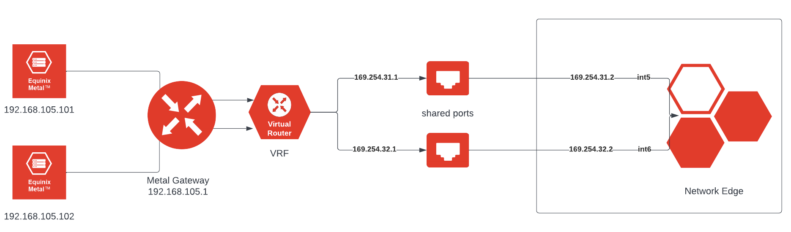
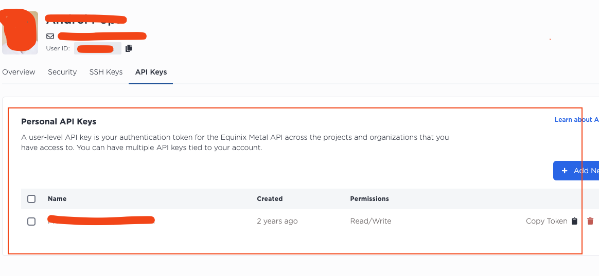
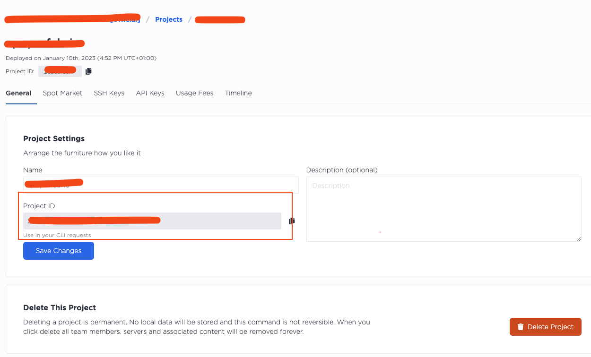
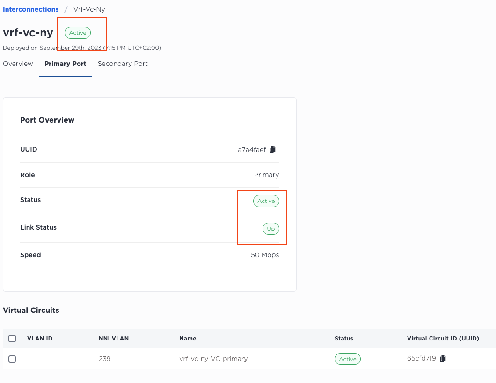
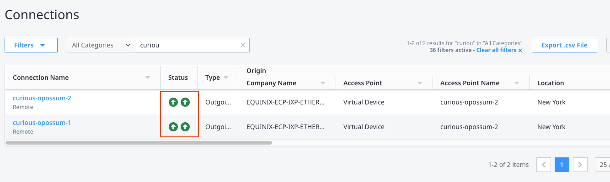
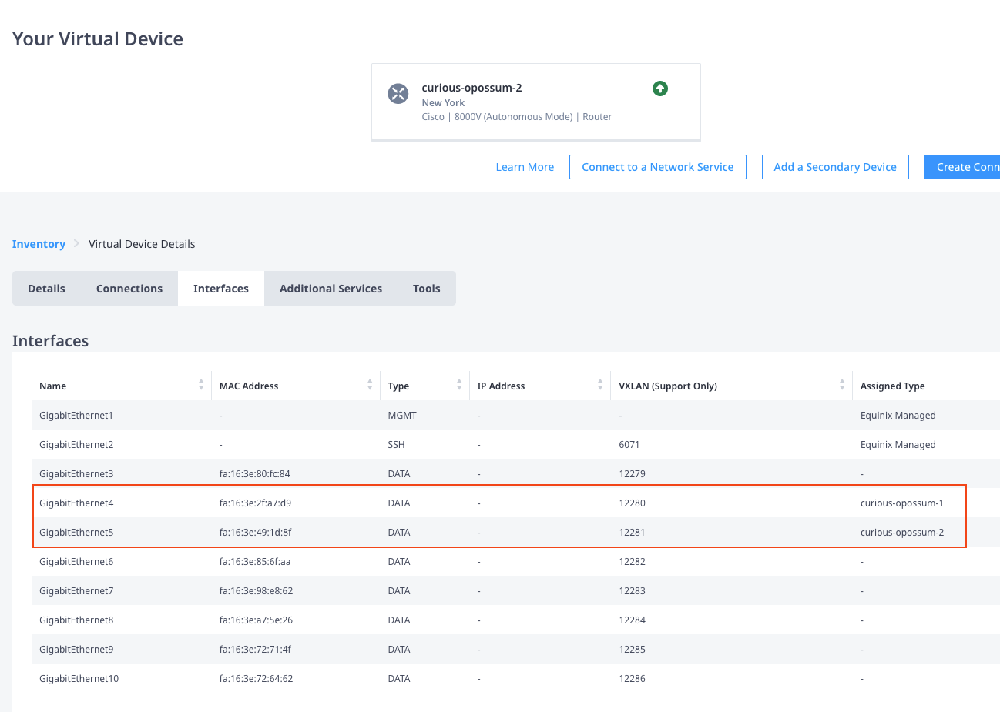

# metal-vrf-shared-ports-wrapper
How to configure Metal VRF using bash wrapper

## Table of Contents
- [Pre-requirement](#pre-requirements)
- [Architecture](#architecture)
- [Inputs](#inputs)
- [Usage](#usage)
- [Testing](#testing)

## Pre-requirements

↥ [back to top](#table-of-contents)

- [Equinix Metal Account](https://console.equinix.com)
- [Equinix Fabric Account](https://fabric.equinix.com)

## Architecture

↥ [back to top](#table-of-contents)



## Inputs

↥ [back to top](#table-of-contents)

as inputs for the setup will be used the following parameters

| Description | Values |
| ----------- | ----------- |
| vlan        | 1005 |
| Metal Gateway | 192.168.105.1 |
| IP Reservation | 192.168.105.0/24 |
| VRF ASN | 65100 |
| VRF 1 | 169.254.31.1/30 |
| VRF 2 | 169.254.32.1/30 |
| VRF ranges | ["169.254.31.0/24","169.254.32.0/24","192.168.105.0/24"] |
| Metal vlan ip | 192.168.105.101/24 |
| Metal vlan ip | 192.168.105.102/24 |
| BGP Loopback | 10.4.0.1/32 |
| NetworkEdge primary | 169.254.31.2/30 |
| NetworkEdge secondary | 169.254.32.2/30 |
| NetworkEdge ASN | 65101 |

> For the simplicity of the demonstration, this diagram and deployment has just one NetworkEdge device, for the production environment the BGP peering have to end up on two different devices.

## Usage

↥ [back to top](#table-of-contents)

For the configuration of VRF functionality we will need the following bash wrapper, which serve as interface to direct API commands via `curl` - [script](https://gist.githubusercontent.com/goldenprifti/850fa74cb08c23b4e3ebac2b01746bab/raw/deede8aa0b5eaa2179aba4dfa7b6b8c1ed89fb93/metal-vrf-v3.sh)

- download the script on your local machine or environment where you'll use it from (`wget`)
- bash script dependencies, we'll have to install `curl` and `jq`

Ubuntu/Debian installation example

```bash
sudo apt-get install curl jq -y
```


before we'll use the script we should have the following dependencies deployed

- Metal server (two as in diagram above)
- vlan in the same metro where we are deploying the Metal servers
- vlans should be attached to the Metal servers
- login to the Metal servers via ssh and configure the `vlan` interfaces

first server

```bash
tee -a /etc/network/interfaces > /dev/null <<-EOD
auto bond0.1005
    iface bond0.1005 inet static
    pre-up sleep 5
    address 192.168.105.101
    netmask 255.255.255.0
    vlan-raw-device bond0
EOD

systemctl restart networking.service
```

second server server

```bash
tee -a /etc/network/interfaces > /dev/null <<-EOD
auto bond0.1005
    iface bond0.1005 inet static
    pre-up sleep 5
    address 192.168.105.102
    netmask 255.255.255.0
    vlan-raw-device bond0
EOD

systemctl restart networking.service
```

at this point the servers should ping each other using these IP's

as input for the script we'll need API token and Project ID - check the screenshots

API Token



Project ID



keep in mind that we can use project level API as well as personal level API token


Create VRF

```bash
vagrant@dig-api:~$ ./metal-vrf-v3.sh

Equinix Metal VRF CLI v3

Enter Equinix Metal API Key: <API-TOKEN>

Enter Equinix Metal Project UUID: <PROJECT-ID>

1) List VRFs			     7) Create IP Reservation		13) Delete IP Reservation	    19) Add Dynamic Neighbor
2) Update VRF			     8) Create Metal Gateway		14) Delete Metal Gateway	    20) List Dynamic Neighbors
3) List IP Reservations		     9) Create VRF VC - Shared Port	15) Delete VRF VC		    21) Delete Dynamic Neighbor
4) List Metal Gateways		    10) Create VRF VC - Dedicated Port	16) Enable Dynamic BGP		    22) Quit
5) List VRF VCs			    11) Update VRF VC			17) Disable Dynamic BGP
6) Create VRF			    12) Delete VRF			18) Enable Export Route Map
Please enter your choice: 6
```

output 

```bash
Create VRF
( Type c to cancel )

Enter VRF Name: vrf-shared-ny
Enter VRF Description: vrf ny shared
Enter Metro Code: AM
Enter Local ASN: 65100

VRF IP Ranges is a list of IP subnets that will be used for private Metal networks with hosts and BGP sessions across Fabric Virtual Circuits.
All subnets in a VRF IP Ranges list will be announced in BGP sessions as long as there is at least one host added to the VLAN which the subnet belongs to.
IPv4 blocks must be between /8 and /29 in size. IPv6 blocks must be between /56 and /64.
Example array: ["10.0.0.0/16", "2001:d78::/56"]

Enter an array of IP Ranges: ["169.254.31.0/24","169.254.32.0/24","192.168.105.0/24"]
Creating the VRF...
Here is the new VRF...
{
  "VRF ID": "21c7c35b-214a-4485-b892-38c89649fca3",
  "Name": "vrf-shared-ny",
  "Description": "vrf ny shared",
  "Metro": "Amsterdam (am)",
  "Local ASN": 65100,
  "IP Ranges": [
    "169.254.31.0/24",
    "169.254.32.0/24",
    "192.168.105.0/24"
  ]
}
Done...
```

Create IP reservations

```bash
Please enter your choice: 7

Create IP Reservation
( Type c to cancel )

Enter Metro Code: AM
Enter VRF UUID: 21c7c35b-214a-4485-b892-38c89649fca3
Enter Network Address: 192.168.105.0
Enter Network CIDR: 24
Creating the IP Reservation...
Here is the new IP Reservation...
{
  "IP Reservation ID": "3a234c55-b778-4226-b9fe-4477523658ab",
  "Metro": "Amsterdam (am)",
  "Subnet": "192.168.105.0/24"
}
Done...
```

Create Metal Gateway

```bash
Please enter your choice: 8

Create Metal Gateway
( Type c to cancel )

Enter Metro Code: AM
Enter VLAN ID: 1005
Enter IP Reservation UUID: 3a234c55-b778-4226-b9fe-4477523658ab
Creating the Metal Gateway...
Here is the new Metal Gateway...
{
  "Metal Gateway ID": "69041777-a49a-4471-93b8-72fb62a6f6a7",
  "Metro": "am",
  "VLAN": 1005,
  "Subnet": "192.168.105.0/24",
  "Gateway IP": "192.168.105.1"
}
Done...
```

Create VRF VC - Shared Ports

```bash
Please enter your choice: 9

Create VRF VC - Shared Port
( Type c to cancel )

Enter VRF UUID: 21c7c35b-214a-4485-b892-38c89649fca3
Enter Metro Code: AM

Choose VC Type:
1) Metal Billed
2) Fabric Billed

Choose VC Type: 2

Choose VC Redundancy:
1) Single
2) Redundant

Choose VC Redundancy: 2

Choose VC Speed:
1) 50mbps
2) 200mbps
3) 500mbps
4) 1gbps
5) 2gbps
6) 5gbps
7) 10gbps

Choose VC Speed: 1
Enter VC Name: vrf-vc-ny


Subnet size can only be /30 or /31
Enter Primary VC Subnet: 169.254.31.0/30
Enter Primary VC Metal Peer IP: 169.254.31.1
Enter Primary VC Customer Peer IP: 169.254.31.2


Subnet size can only be /30 or /31
Enter Secondary VC Subnet: 169.254.32.0/30
Enter Secondary VC Metal Peer IP: 169.254.32.1
Enter Secondary VC Customer Peer IP: 169.254.32.2


Enter Peer ASN: 65101
Enter BGP Password (leave empty if you don't want a password for the BGP session:

Creating the VC...
VC created successfully.
Applying VRF BGP peering settings...
Here is the primary VC...
{
  "VC ID": "65cfd719-235e-4a46-a381-d7b933739b31",
  "VC Name": "vrf-vc-ny-VC-primary",
  "Metro": "am",
  "VC NNI": 239,
  "Peer ASN": 65101,
  "Peering Subnet": "169.254.31.0/30",
  "Metal Peer IP": "169.254.31.1",
  "Customer Peer IP": "169.254.31.2",
  "BGP Password": ""
}
Here is the secondary VC...
{
  "VC ID": "acaa4ff2-ae14-4bbe-bf3f-0ab1037f303d",
  "VC Name": "vrf-vc-ny-VC-secondary",
  "Metro": null,
  "VC NNI": 2325,
  "Peer ASN": 65101,
  "Peering Subnet": "169.254.32.0/30",
  "Metal Peer IP": "169.254.32.1",
  "Customer Peer IP": "169.254.32.2",
  "BGP Password": ""
}
```

as soon as the Interconnection request will be created we'll have two token which needs to be redeem in the Fabric portal exactly as explained in this [documentation](https://deploy.equinix.com/developers/docs/metal/interconnections/fabric-billed-fabric-vc/). This deployment example using Fabric billed interconnection.

as soon as connection are established, up and active (see screenshot) we can proceed with Network Edge configuration

VC active and UP



Fabric connections up



Connections will be terminated on the Network Edge interfaces (see screenshot)



Login to the Network Edge using public ip and configure interfaces

Int 4

```bash
curious-opossum-2(config)#int g4
curious-opossum-2(config-if)#ip add
curious-opossum-2(config-if)#ip address 169.254.31.2 255.255.255.252
curious-opossum-2(config-if)#no shut
curious-opossum-2(config-if)#end
```

Int 5

```bash
curious-opossum-2(config)#int g5
curious-opossum-2(config-if)#ip add
curious-opossum-2(config-if)#ip address 169.254.32.2 255.255.255.252
curious-opossum-2(config-if)#no shut
curious-opossum-2(config-if)#end
```

Check the interfaces status

```bash
curious-opossum-2#sho ip int br
Interface              IP-Address      OK? Method Status                Protocol
GigabitEthernet3       unassigned      YES unset  administratively down down
GigabitEthernet4       169.254.31.2    YES manual up                    up
GigabitEthernet5       169.254.32.2    YES manual up                    up
GigabitEthernet6       unassigned      YES unset  administratively down down
GigabitEthernet7       unassigned      YES unset  administratively down down
GigabitEthernet8       unassigned      YES unset  administratively down down
GigabitEthernet9       unassigned      YES unset  administratively down down
GigabitEthernet10      unassigned      YES unset  administratively down down
```

Check ICMP to the VRF 

```bash
curious-opossum-2#ping 169.254.31.1
Type escape sequence to abort.
Sending 5, 100-byte ICMP Echos to 169.254.31.1, timeout is 2 seconds:
!!!!!
Success rate is 100 percent (5/5), round-trip min/avg/max = 73/73/74 ms
curious-opossum-2#ping 169.254.32.1
Type escape sequence to abort.
Sending 5, 100-byte ICMP Echos to 169.254.32.1, timeout is 2 seconds:
!!!!!
Success rate is 100 percent (5/5), round-trip min/avg/max = 75/75/76 ms
```

Configure BGP

```bash
curious-opossum-2#conf t
curious-opossum-2(config)#router bgp 65101
curious-opossum-2(config-router)#bgp router-id 10.4.0.1
curious-opossum-2(config-router)#bgp log-neighbor-changes
curious-opossum-2(config-router)#neighbor 169.254.31.1 remote-as 65100
curious-opossum-2(config-router)#neighbor 169.254.32.1 remote-as 65100
curious-opossum-2(config-router)#address-family ipv4
curious-opossum-2(config-router-af)#network 10.4.0.0 mask 255.255.0.0
curious-opossum-2(config-router-af)#redistribute connected
curious-opossum-2(config-router-af)#neighbor 169.254.31.1 activate
curious-opossum-2(config-router-af)#neighbor 169.254.32.1 activate
```

Check BGP status

```bash
curious-opossum-2#sho ip bgp
BGP table version is 8, local router ID is 10.4.0.1
Status codes: s suppressed, d damped, h history, * valid, > best, i - internal,
              r RIB-failure, S Stale, m multipath, b backup-path, f RT-Filter,
              x best-external, a additional-path, c RIB-compressed,
              t secondary path, L long-lived-stale,
Origin codes: i - IGP, e - EGP, ? - incomplete
RPKI validation codes: V valid, I invalid, N Not found

     Network          Next Hop            Metric LocPrf Weight Path
 *>   169.254.31.0/30  0.0.0.0                  0         32768 ?
 *                     169.254.31.1                           0 65100 i
 *>   169.254.32.0/30  0.0.0.0                  0         32768 ?
 *                     169.254.32.1                           0 65100 i
 *    192.168.105.0    169.254.32.1                           0 65100 54825 i
 *>                    169.254.31.1                           0 65100 54825 i
```

Check ICP Metal Gateway

```bash
curious-opossum-2#ping 192.168.105.1
Type escape sequence to abort.
Sending 5, 100-byte ICMP Echos to 192.168.105.1, timeout is 2 seconds:
!!!!!
Success rate is 100 percent (5/5), round-trip min/avg/max = 73/73/74 ms
```

Configure Loopback interface

```bash
curious-opossum-2#conf t
curious-opossum-2(config)#int loopback0
curious-opossum-2(config-if)#ip add
curious-opossum-2(config-if)#ip address 10.4.0.1 255.255.255.255
curious-opossum-2(config-if)#no shut
curious-opossum-2(config-if)#end
curious-opossum-2#wr mem
```

On the both Linux servers


```bash
ip route show
ip route delete 10.0.0.0/8 via x.x.x.x
ip route add 10.0.0.0/8 via GW_IP dev bond0.VLAN_ID
ip route show
```

## Testing

↥ [back to top](#table-of-contents)

Check the Linux servers

```bash
root@proud-salmon-amsterdam1:~# ping 10.4.0.1
PING 10.4.0.1 (10.4.0.1) 56(84) bytes of data.
64 bytes from 10.4.0.1: icmp_seq=1 ttl=253 time=75.2 ms
```

On the NetworkEdge

```bash
curious-opossum-2#ping 192.168.105.101 source Loopback0
Type escape sequence to abort.
Sending 5, 100-byte ICMP Echos to 192.168.105.101, timeout is 2 seconds:
Packet sent with a source address of 10.4.0.1
!!!!!
Success rate is 100 percent (5/5), round-trip min/avg/max = 75/75/76 ms
curious-opossum-2#ping 192.168.105.102 source Loopback0
Type escape sequence to abort.
Sending 5, 100-byte ICMP Echos to 192.168.105.102, timeout is 2 seconds:
Packet sent with a source address of 10.4.0.1
!!!!!
Success rate is 100 percent (5/5), round-trip min/avg/max = 76/114/267 ms
```

Both servers are reachable